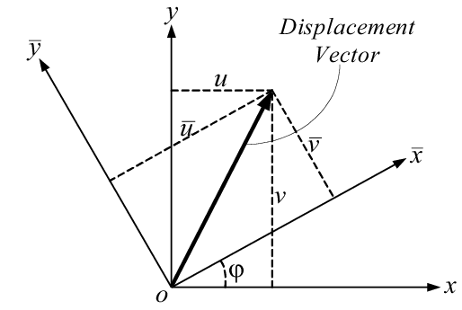

# DeadReckoning
Almost any computerized machine that flies has an IMU (Inertial Measurement Unit) inside of it. Planes, drones, helicopters, rockets, and missiles all use IMUs to determine their orientation in space. An IMU generally contains an accelerometer, gyroscope, and magnetometer which each report data on three axes. To determine a vehicle’s orientation, a sensor fusion algorithm takes in data from these sensors to calculate pitch, yaw, and roll values in the global reference frame.
However, when a vehicle is under prolonged constant acceleration (for example, a rocket during takeoff) these fusion algorithms can no longer be used. In this environment, the acceleration vector will no longer be congruent with gravity, leading to incorrect orientation calculations. Because of this, it becomes necessary to switch over to only using the gyroscope during these periods. However, gyroscopes can only measure angular velocity, not angular position. Furthermore, gyroscopes can only sense angular velocity in the vehicle’s reference frame, not a global frame.



To accurately determine the orientation of a vehicle using only the IMU’s gyroscope data, we must first determine our initial position before the period of increased acceleration. I created the following function which takes in acceleration along each axis, and resets the pitch and roll values. By taking the arcsin of an axis's acceleration value divided by the total acceleration value, we can determine the absolute angle.
```
void reorient(float accX, float accY, float accZ) {
  float totalAccelVec = sqrt(sq(accX) + sq(accY) + sq(accZ));
  pitch = -asin(accX / totalAccelVec);
  roll = asin(accY / totalAccelVec);
}
```

Once we have our initial orientation, our control loop must run at a high speed (50 to 100Hz) while it constantly performs two actions: (1) transform our local angular velocity to global angular velocity, and (2) integrate the angular velocity to determine orientation in the global frame. The matrix below is used to transform the local velocity to global velocity. In this matrix, [p, q, r] are the vehicle velocity rates, [Φ, Θ, Ψ] are the euler angles, and [Φ dot, Θ dot, Ψ dot] are the euler (world frame) rates.


(For reference, here are how the axes are defined)


Finally, with some super dope matrix multiplication, we get to the core of our code:
```
float velX = velRoll + velPitch * (sin(roll) * tan(pitch)) + velYaw * (cos(roll) * tan(pitch));
roll = (velX * dt) + lastPosX;
lastPosX = roll;

float velY = velPitch * cos(roll) - velYaw * sin(roll);
pitch = (velY * dt) + lastPosY;
lastPosY = pitch;

float velZ = velPitch * (sin(roll) / cos(pitch)) + velYaw * (cos(roll) / cos(pitch));
yaw = (velZ * dt) + lastPosZ;
lastPosZ = yaw;
```

Created by Ryan Westcott
ryan@westcott.email
